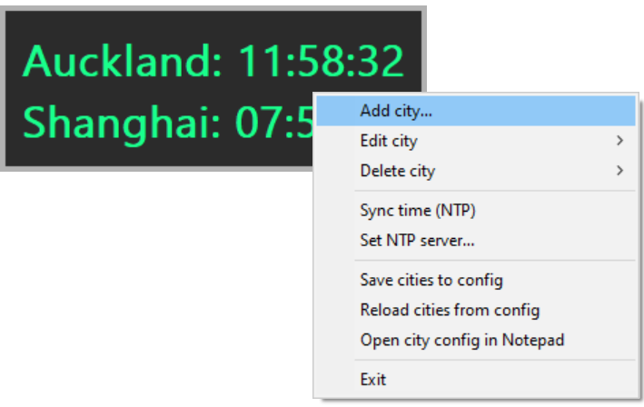
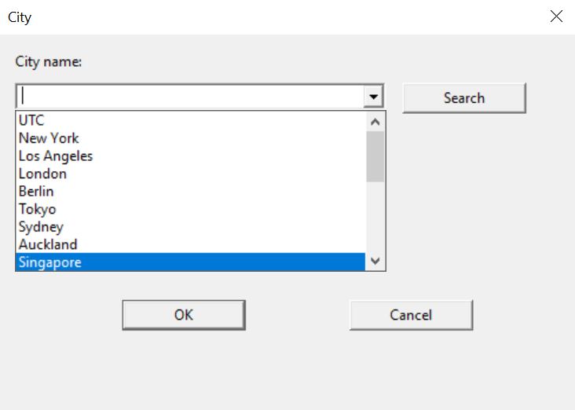
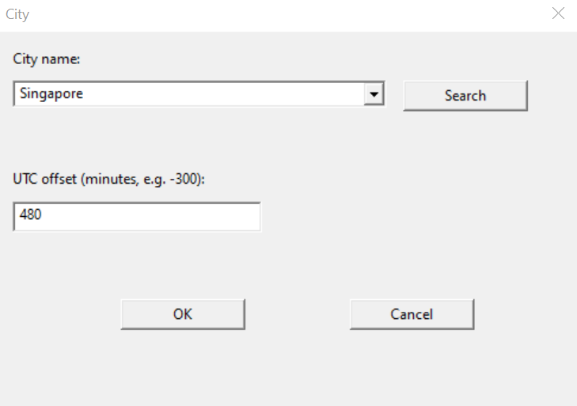
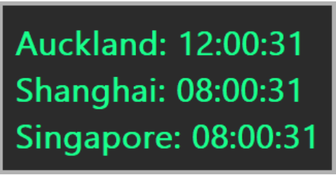

# Digital Clock (Win32)

## Fully AI generated
This project was completed by **Codex (GPT-5.1-MAX) in 2 hours** . Although the author is a proficient C/C++ developer with 20+ years of experience, this time he did not manually write a single line of code.


## Features
- **Multi-city display** with per-city UTC offsets; add/edit/delete cities at runtime via right-click context menu.
- **DST auto-detection** for common cities:
  - New York, Los Angeles, Chicago, San Francisco, Toronto, Mexico City, London, Berlin, Paris, Sydney, Auckland
     Other cities use fixed offsets.
- **NTP time sync** (default: `pool.ntp.org`) with:
  - manual sync
  - set server / reset to default
     Falls back to local system time if NTP is unavailable.
- **Persistent configuration**
  - `config/cities.txt`
  - `config/ntp.txt`
     Files are created on first save/sync.
- **Lightweight and dependency-free**: single EXE, Win32 + C++17 only.

## UI / Context menu
Floating, always-on-top multi-city clock for Windows 10 written in C++17 with Win32 APIs. The window is non-resizable, auto-sizes to its content, uses a dark background with green text, and a thin metal-gray frame.


#### Context menu
right-click the main GUI


### Add City




## Installation (recommended)

Download the latest prebuilt binary from **GitHub Releases** (once enabled):

- Go to the repository page → **Releases**
- Download `digital-clock.exe` (or the `.zip`) and run it

## Build

### Prerequisites

- Windows 10/11
- Visual Studio 2022 Build Tools (MSVC) + Windows SDK
- VS Code (optional, recommended)

`.vscode/settings.json` is pre-filled for:

- MSVC `14.44.35207`
- Windows SDK `10.0.26100.0`

If your install path/version differs, adjust `.vscode/settings.json` accordingly.

### Build using VS Code Tasks (recommended)

1. **Terminal → Run Build Task…**
2. Choose:
   - **Build digital-clock (Debug)**, or
   - **Build digital-clock (Release)**
3. Artifacts:
   - `output/digital-clock.debug.exe`
   - `output/digital-clock.exe`

### Build from command line

Adjust include/lib paths if needed:

```powershell

cl /nologo /std:c++17 /EHsc /DUNICODE /D_UNICODE /W4 /O2 /MD ^  /Fe:output\digital-clock.exe /Fo:output\digital-clock.obj src\main.cpp ^  /link /SUBSYSTEM:WINDOWS user32.lib gdi32.lib shell32.lib ws2_32.lib comdlg32.lib
```

## Run

- Launch the built executable from `output\`. The window starts topmost around position 100x100.
- Drag with left-click; right-click to open the context menu.

## Context menu quick reference
- `Add city...` / `Edit city` / `Delete city`
- `Save cities to config` / `Reload cities from config` / `Open city config in Notepad`
- `Sync time (NTP)` / `Set NTP server...` (includes Reset to `pool.ntp.org`)
- `Exit`

## Configuration files
- `config/cities.txt` - format `Name|OffsetMinutes` (UTC offset in minutes, e.g., `Shanghai|480`). Invalid lines are ignored. Defaults: Auckland (+720) and Shanghai (+480) are loaded if no file exists or the file is empty.
- `config/ntp.txt` - single line with the server host or IP. Defaults to `pool.ntp.org` and is overwritten when you use Reset.

## Runtime behavior
- Display updates every second. When NTP succeeds, timekeeping uses the fetched timestamp plus monotonic ticks; otherwise it uses `GetSystemTimeAsFileTime`.
- Window styles: `WS_EX_TOPMOST | WS_EX_TOOLWINDOW | WS_EX_LAYERED` with slight transparency; custom frame drawn inside the client area.

## Project layout
- `src/main.cpp` - all application code (window, drawing, dialogs, NTP, DST, config I/O).
- `config/` - persisted city and NTP settings (created on demand).
- `.vscode/` - build tasks and toolchain settings for MSVC/WinSDK.

## License
Copyright (c) 2025 Ken Masters

This project is licensed under **GPL-3.0-or-later**. See the `LICENSE` file for details.
